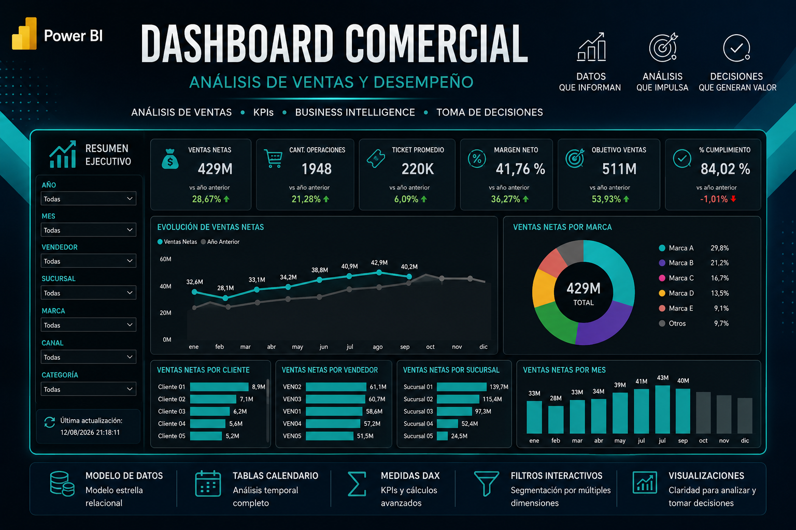
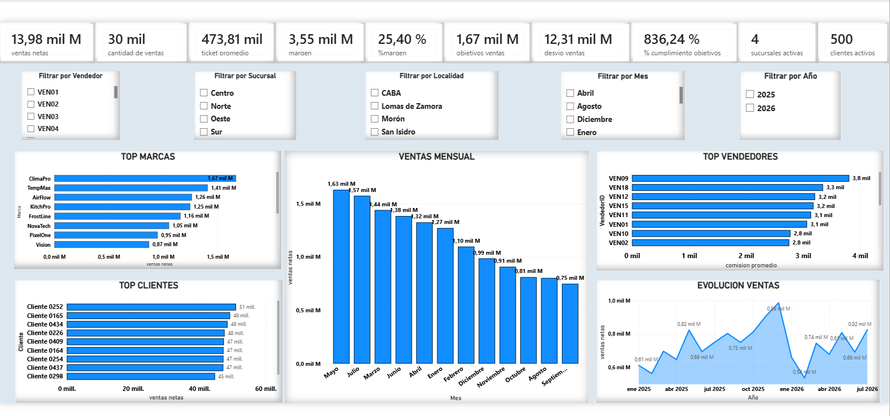
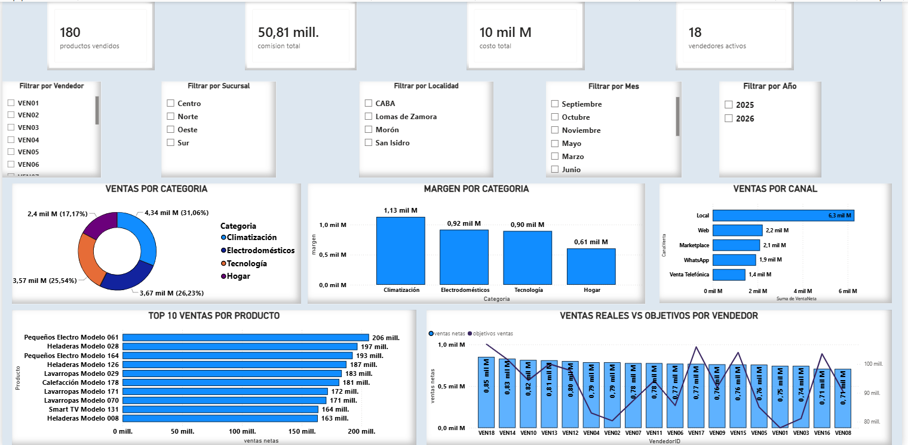

## 📸 Vista del Dashboard

## 📸 Vistas adicionales

# portfolio-julian-
Portafolio de proyectos de análisis de datos, reporting, dashboards y gestión comercial.

# 📊 Dashboard Comercial – Análisis de Ventas y Desempeño

**Herramienta:** Power BI  
**Tipo de proyecto:** Business Intelligence – Análisis Comercial y Gerencial  
**Objetivo:** Transformar datos en KPIs, tendencias y visualizaciones interactivas para facilitar el seguimiento del negocio y la toma de decisiones.

---

## 🧠 Modelo de Datos
- Estructura relacional tipo estrella  
- Tablas calendario para análisis temporal  
- Medidas DAX para KPIs y cálculos de negocio  
- Filtros interactivos por vendedor, sucursal, localidad, mes y año

---

## 🔍 Principales KPIs
- Ventas netas  
- Ticket promedio  
- Margen neto  
- Objetivos y cumplimiento  
- Clientes y vendedores activos  

---

## 📈 Visualizaciones destacadas
- **Top Marcas y Clientes**  
- **Evolución de Ventas Mensual**  
- **Top Vendedores y Comisiones**  
- **Ventas por Categoría y Canal**  
- **Comparativo Ventas Reales vs Objetivos**

---

## 💡 Insights del proyecto
- Identificación de marcas y canales más rentables  
- Seguimiento de cumplimiento de objetivos por vendedor  
- Análisis de márgenes y costos por categoría  
- Visualización clara de la evolución temporal de ventas  

---

## 🧰 Herramientas utilizadas
- Power BI  
- Excel (fuente de datos)  
- DAX  
- Power Query  

---

