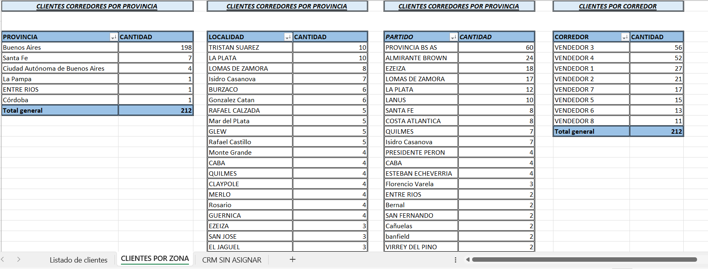

# 📊 Segmentación Comercial de Clientes

🎯 **Objetivo**  
Analizar la distribución de clientes por zona geográfica y corredor comercial, identificando oportunidades, concentración de ventas y asignación de vendedores.

📁 **Conjunto de datos**  
Incluye información detallada de:
- ID de cliente  
- Tipo de cliente  
- Identificación fiscal  
- Razón social y nombre  
- Lista de precios  
- Contactos  
- Provincia, localidad y partido  
- Vendedor asignado  

📈 **Resumen general**
- **212 clientes totales**  
- Segmentación por **provincia**, **localidad**, **partido** y **corredor/vendedor**  
- Identificación de zonas con mayor densidad comercial  
- Detección de áreas con baja cobertura de vendedores  

📊 **Indicadores clave (KPI)**  
- Clientes por provincia  
- Clientes por localidad  
- Clientes por partido  
- Clientes por corredor/vendedor  
- Ranking de vendedores por cantidad de clientes asignados  

🔍 **Insights relevantes**  
- La provincia de Buenos Aires concentra la mayor cantidad de clientes.  
- Localidades como Tristán Suárez, La Plata, Lomas de Zamora, Isidro Casanova, Burzaco y González Catán presentan alta densidad comercial.  
- La distribución por corredor muestra diferencias marcadas en la cantidad de clientes asignados.  
- Provincias con baja presencia (Santa Fe, La Pampa, Entre Ríos, Córdoba) representan oportunidades de expansión comercial.

🛠️ **Herramientas utilizadas**  
- Excel avanzado  
- Tablas dinámicas  
- Segmentación por múltiples campos  
- Limpieza y normalización de datos  
- Consolidación de zonas y corredores  

📁 **Estructura del repositorio**
