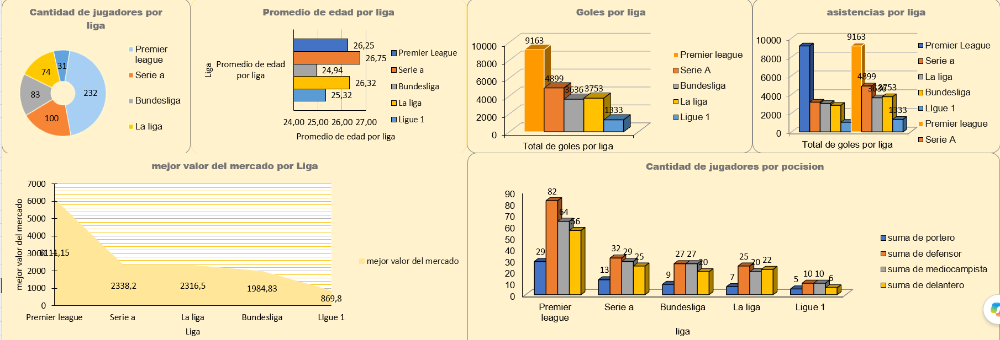

# ⚽ **Análisis Deportivo de Ligas 2021**

🎯 **Objetivo**  
Analizar el rendimiento de equipos y jugadores durante la temporada 2021 mediante métricas clave, análisis estadístico y visualizaciones en Excel.

📁 **Conjunto de datos**  
Datos de:
- Partidos disputados  
- Goles y asistencias  
- Minutos jugados  
- Rendimiento ofensivo y defensivo  
- Comparativas entre equipos y jugadores  

📊 **Indicadores clave (KPI)**  
- Goles por partido  
- Eficacia ofensiva (goles / remates)  
- Eficacia defensiva (goles recibidos / partidos)  
- Participación en jugadas de gol  
- Comparativa de rendimiento acumulado por equipo  
- Tendencias de desempeño a lo largo de la temporada  

🔍 **Insights relevantes**  
- Jugadores con mayor impacto ofensivo  
- Equipos con mejor consistencia defensiva  
- Variaciones de rendimiento entre meses  
- Patrones que explican rachas positivas y negativas  

🛠️ **Herramientas utilizadas**  
- Excel avanzado  
- Tablas dinámicas  
- Gráficos dinámicos  
- Segmentadores y filtros  
- Fórmulas avanzadas (BUSCARV, SUMAR.SI.CONJUNTO, PROMEDIO.SI)  
- Dashboard final con KPIs  

🖼️ **Portada del proyecto**  
> Subí tu imagen como `PORTADA.png` dentro de esta carpeta.  
> Luego reemplazá la URL en este bloque:

