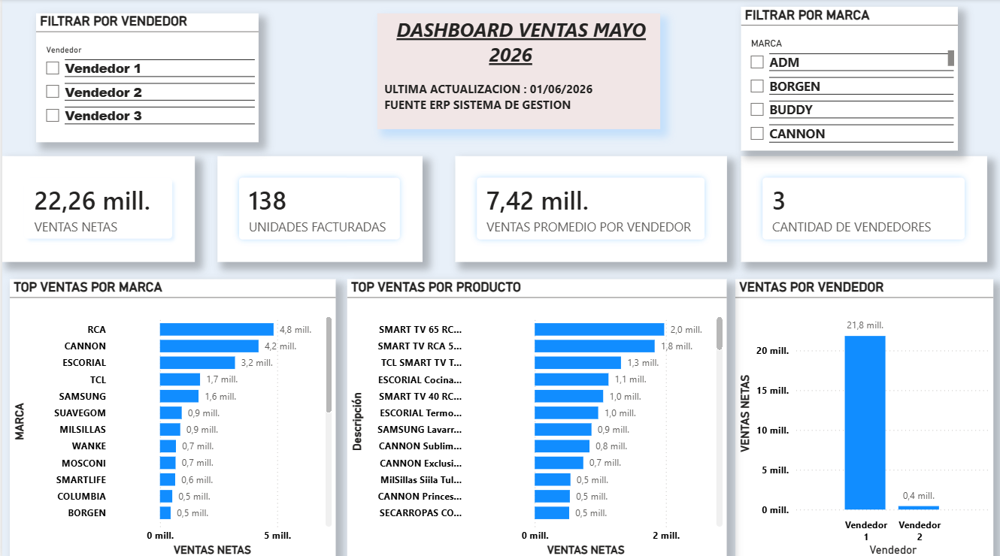

# Dashboard de Ventas Mensual – Comercio (Mayo 2026)

## 🎯 Objetivo
Desarrollar un dashboard interactivo en Power BI para el seguimiento de indicadores comerciales del mes de mayo 2026.  
El proyecto permite analizar ventas netas, unidades facturadas, desempeño por vendedor, marcas y productos, facilitando la toma de decisiones comerciales.

## 🧩 Proceso del Proyecto
Este dashboard fue construido aplicando técnicas de análisis y modelado de datos:

- Proceso ETL con **Power Query**  
- Modelado de datos con relaciones y tablas normalizadas  
- Creación de **medidas DAX** para KPIs  
- Visualizaciones dinámicas y segmentaciones  
- Integración de datos provenientes del **ERP Sistema de Gestión**

> “El proyecto incluye modelado de datos, proceso ETL con Power Query, creación de medidas DAX, KPIs y visualizaciones…”  
> *(Proyecto_PowerBI_Ventas_Mayo_Portafolio.pdf)*

---

## 📁 Dataset
El dataset incluye información de:

- Ventas por producto  
- Marcas  
- Vendedores  
- Facturas y notas de crédito  
- Unidades facturadas y devueltas  
- Subtotales netos  
- Variación porcentual por artículo  

Ejemplo real del dataset:

> “SMART TV 65 RCA ANDROID – 1.974.141,69 – 2 unidades facturadas”  
> “CANNON Sublime – 834.617,11 – 1 unidad facturada”  
> *(VENTAS MAYO-1.xlsx)*

---

## 📈 KPIs Principales

- **Ventas Netas:** 22,26 mill.  
- **Unidades Facturadas:** 138  
- **Cantidad de Vendedores:** 3  
- **Venta Promedio por Vendedor:** 7,42 mill.

> “22,26 mill. – Ventas Netas”  
> “138 – Unidades Facturadas”  
> *(Proyecto_PowerBI_Ventas_Mayo_Portafolio.pdf)*

---

## 🔝 Top Ventas por Marca

- **RCA:** 4,8 mill.  
- **CANNON:** 4,2 mill.  
- **ESCORIAL:** 3,2 mill.  
- **TCL:** 1,7 mill.  
- **SAMSUNG:** 1,6 mill.

> “RCA 4,8 mill. – CANNON 4,2 mill. – ESCORIAL 3,2 mill.”  
> *(Proyecto_PowerBI_Ventas_Mayo_Portafolio.pdf)*

---

## 🔝 Top Ventas por Producto

- **SMART TV 65 RCA Android:** 2,0 mill.  
- **SMART TV RCA 55 Google 4K:** 1,8 mill.  
- **TCL QLED 55”:** 1,3 mill.  
- **ESCORIAL Cocina Master Style:** 1,1 mill.  
- **SMART TV RCA 40”:** 1,0 mill.

> “SMART TV 65 RCA ANDROID – 1.974.141,69”  
> “SMART TV RCA 55 GOOGLE 4K – 1.828.596,77”  
> *(VENTAS MAYO-1.xlsx)*

---

## 👤 Ventas por Vendedor

- **Vendedor 1:** 21,8 mill.  
- **Vendedor 2:** 0,4 mill.  
- **Vendedor 3:** sin ventas registradas

> “Vendedor 1 – 21,8 mill.”  
> *(Proyecto_PowerBI_Ventas_Mayo_Portafolio.pdf)*

---

## 🎛 Segmentaciones del Dashboard

El panel permite filtrar por:

- **Vendedor**  
- **Marca**  

> “FILTRAR POR VENDEDOR – Vendedor 1, 2, 3”  
> “FILTRAR POR MARCA – ADM, BORGEN, BUDDY, CANNON…”  
> *(Proyecto_PowerBI_Ventas_Mayo_Portafolio.pdf)*

---

## 🧰 Herramientas Utilizadas

- Power BI  
- Power Query (ETL)  
- Modelado de Datos  
- Medidas DAX  
- KPIs Comerciales  

---

# ✔ Resultado
Dashboard mensual completo, dinámico y orientado a la toma de decisiones comerciales, con análisis por vendedor, marca, producto y KPIs clave del negocio.

